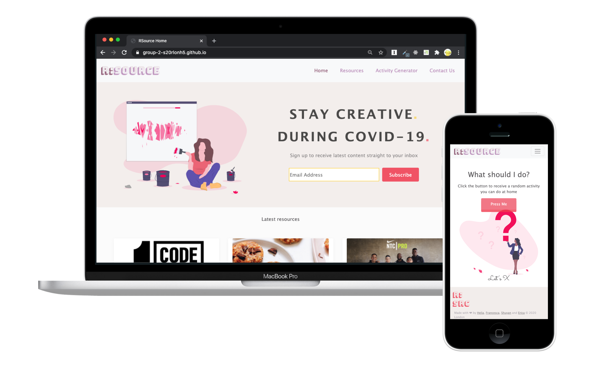
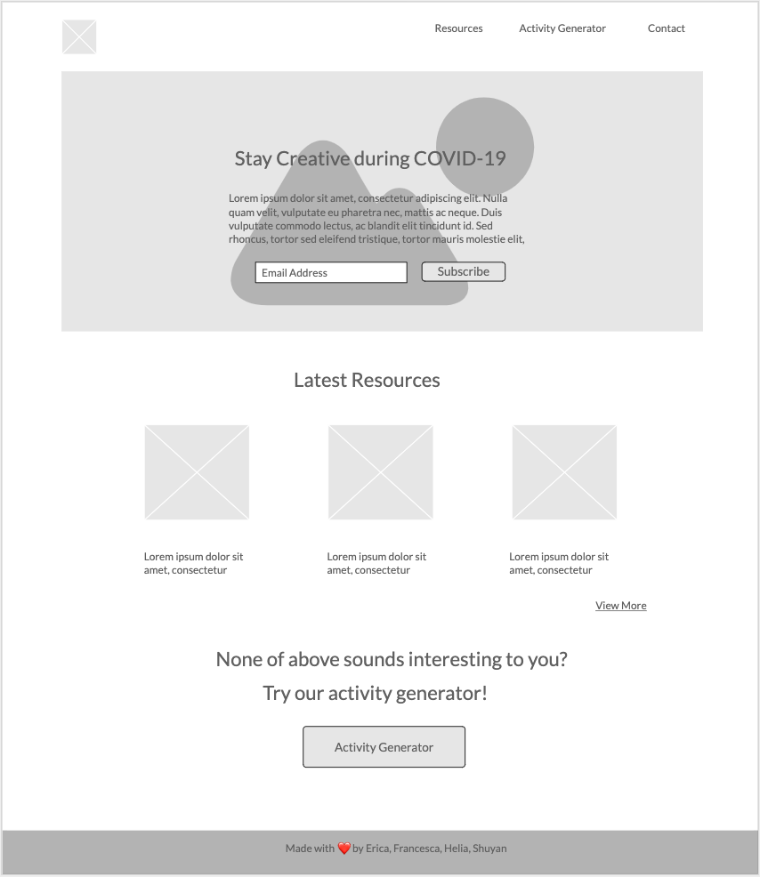
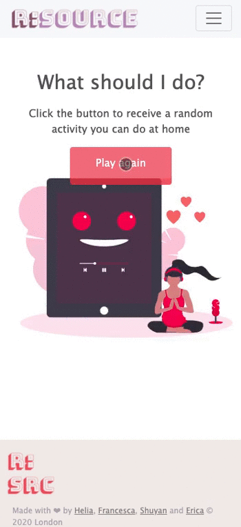

# R:Source

Code First Girls Web development Course group project - a resource collection site with an activity generator to help stay creative during COVID-19. 

## 💻Techstack
    

## 👯The team

- [Helia](https://www.instagram.com/rainilyahead/) - Landing Page 
- [Francesca](https://www.instagram.com/francescacx_/) - Resources Page 
- [Clementine](https://github.com/clemcodes) - Activity Generator
- [Erica](https://www.instagram.com/__theep/) - Contact Page

## 🎨Design
We took it from wireframe design to final presentation in a week. We collaborated on Mockups to create the wireframes.

Wireframe sample👇

  
## ⏳Difficulties we met & Unmet goals
There were some difficulties we've met and a few things we didn't do as due to time constraints. These included:
- [ ] Implementing a unified style by combining Bootstrap with plain HTML/CSS
- [ ] Naming of the files
- [ ] Testing

## 📙Key takeaways
- We picked up quickly how to collaborate on Github in a limited amount of time
- Wireframing with teammates
- Scheduling meetings and distributing the workload
- Incorporate Javascript to make pages interactive on submit
- Animation effect with Javascript

  

